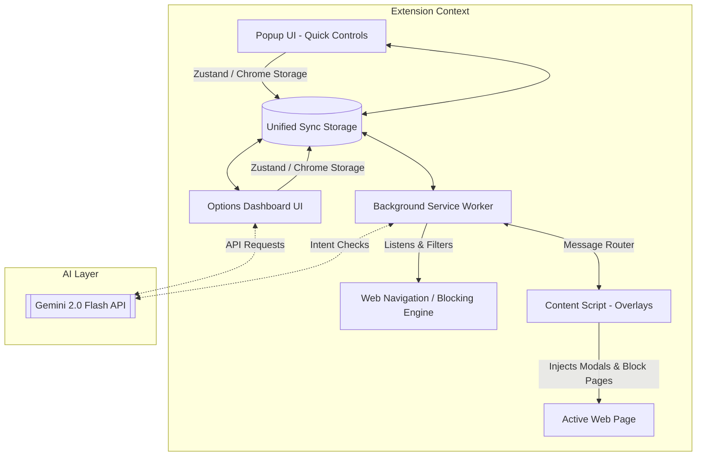

# 🛡️ FocusGuard AI

> **Your Premium, AI-Powered Productivity Companion Browser Extension**

FocusGuard AI is a state-of-the-art Chrome extension designed to eliminate online distractions, gamify your concentration, and provide real-time cognitive assistance. Powered by **Google Gemini 2.0 Flash**, FocusGuard AI goes beyond simple website blocking by analyzing your intent, coaching you with personalized insights, and fostering a virtual pet that evolves alongside your productivity.

---

## ✨ Features at a Glance

FocusGuard AI is packed with rich, premium features that transform how you manage your focus:

### 🤖 1. AI Intent Verification (Powered by Gemini 2.0 Flash)
* **Real-Time Analysis**: When visiting potentially distracting websites (e.g., YouTube, Reddit, X), FocusGuard intercepts your navigation and prompts you for a reason.
* **Contextual Evaluation**: The AI analyzes your stated intent against your current focus goal and time remaining, determining if the visit is **Productive**, **Neutral**, or **Distracting**.
* **Friendly Warnings**: If deemed a distraction, the AI offers a polite but firm reality check to help keep you on track.

### 🎮 2. Gamified Focus Pet (`FocusBuddy`)
* **Evolutionary Progression**: Grow your virtual companion from a 🌱 **Seed** to a 🌿 **Sprout**, 🌻 **Plant**, 🌳 **Tree**, 🌲 **Forest**, and ultimately a 🌌 **Galaxy Tree**!
* **XP Rewards**: Earn XP by completing focus sessions, maintaining distraction-free streaks, and hitting daily goals.
* **Daily Streaks**: Feed your Focus Pet by completing your first daily focus sessions, encouraging a consistent daily routine.

### 🤖 3. Personal AI Productivity Coach
* **Tailored Coaching**: Ask the AI Coach anything or let it proactively analyze your focus history, streaks, and top distractions to offer actionable recommendations.
* **Insight Generation**: Extract deep observations about your focus patterns (e.g., Identifying which days are your most productive or pinpointing key distraction triggers).

### 📊 4. Deep Analytics & Automated PDF Reports
* **Interactive Dashboards**: Visualizes focus time vs. distraction time with premium **Recharts** area charts and custom indicators.
* **Weekly Performance Score**: Get a score out of 100 assessing your focus efficiency.
* **PDF Exporter**: Generate professional, beautifully formatted PDF reports of your productivity history with a single click, complete with AI-generated weekly insights.

### 🚫 5. Advanced Site Blocker & Session Manager
* **Custom & Default Lists**: Pre-loaded list of common distractions with the ability to add unlimited custom domains.
* **Smart Overrides**: Request temporary passes for blocked sites with a valid reason, tracked and evaluated by the extension.
* **Custom Session Durations**: Configurable pomodoro or deep-work sessions with custom target goals.

---

## 🛠️ Tech Stack

FocusGuard AI is built with modern, light-weight, and super-fast frontend technologies:

* **Framework**: React 18 & TypeScript
* **Bundler & Tooling**: Vite & `@crxjs/vite-plugin` (Manifest V3)
* **Styling**: Vanilla CSS with modern HSL dynamic color variables & Tailwind CSS
* **State Management**: Zustand (with unified Chrome Storage synchronization)
* **AI Integration**: `@google/generative-ai` (Gemini 2.0 Flash API)
* **Data Visualization**: Recharts
* **Document Generation**: jsPDF & html2canvas

---

## 📂 Project Architecture

FocusGuard AI is structured cleanly, adhering to Chrome Extension Manifest V3 security and architecture guidelines:



### Key Directories
* `src/background/`: Contains the service worker handling session management, tab tracking, alarms, and the navigation blocking engine.
* `src/content/`: Houses the injected content scripts responsible for showing the AI intent modal overlay and the focus blocking page on target tabs.
* `src/popup/`: The quick-access dropdown UI when clicking the extension icon. Contains timer controls and rapid blocking toggles.
* `src/options/`: The main full-screen dashboard page containing the interactive Analytics, AI Coach chat, Focus Pet evolution yard, Daily Goals, and Settings.
* `src/stores/`: Zustand stores synchronizing state (achievements, pet, sessions, settings, tracking) transparently across background, options, and popup scripts.
* `src/services/`: Core helper services including Gemini AI endpoints, storage operations, and PDF generation.

---

## 🚀 Getting Started (Local Development)

Follow these steps to set up and run FocusGuard AI on your local machine:

### Prerequisites
* Ensure you have [Node.js](https://nodejs.org/) (v18+) installed.
* Ensure you have `npm` or `yarn` installed.

### 1. Clone & Install Dependencies
```bash
# Navigate to the workspace directory
cd Normal

# Install required node modules
npm install
```

### 2. Configure Your Environment
1. Copy the `.env.example` to a new `.env` file:
   ```bash
   cp .env.example .env
   ```
2. Open the `.env` file and insert your Google Gemini API Key:
   ```env
   VITE_GEMINI_API_KEY=your_actual_gemini_api_key_here
   ```
   *(Note: You can also configure the API Key directly in the Extension Settings UI if you prefer not to hardcode it in `.env`)*

### 3. Start Development Server
```bash
npm run dev
```
This builds the extension inside the `dist/` directory and starts Vite's asset compiler.

### 4. Load the Extension into Google Chrome
1. Open Google Chrome and navigate to `chrome://extensions/`.
2. Enable **Developer mode** using the toggle switch in the top-right corner.
3. Click the **Load unpacked** button in the top-left corner.
4. Select the **`dist`** directory located inside the FocusGuard AI project folder.
5. FocusGuard AI is now loaded! Pin it to your browser toolbar for quick access.

---

## 🔑 How to Get a Gemini API Key

FocusGuard AI leverages the free or paid tier of Google Gemini for its productivity coaching and intent checks.

1. Go to the [Google AI Studio](https://aistudio.google.com/).
2. Sign in with your Google account.
3. Click **Get API key** in the sidebar.
4. Click **Create API key** (choose a new or existing Google Cloud project).
5. Copy your API Key and paste it into either:
   * The `.env` file as `VITE_GEMINI_API_KEY`
   * The **Settings** tab inside the FocusGuard AI dashboard.

---

## 🏆 Achievements System

FocusGuard features a dynamic gamification badge engine. Unlock premium badges as you succeed:
* 🎯 **First Step**: Start your first focus session.
* 🔥 **Focused Mind**: Complete 5 sessions total.
* 🛡️ **Iron Shield**: Complete a session without checking any blocked site.
* 🌿 **Green Thumb**: Evolve your pet to a Sprout.
* 🌌 **Cosmic Guardian**: Evolve your pet to the supreme Galaxy Tree stage.

---

## 🛡️ License & Copyright

FocusGuard AI is private property. All rights reserved. Built with love to revolutionize digital mindfulness. 🚀
